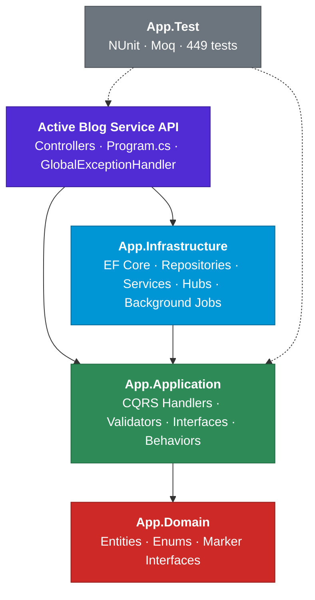
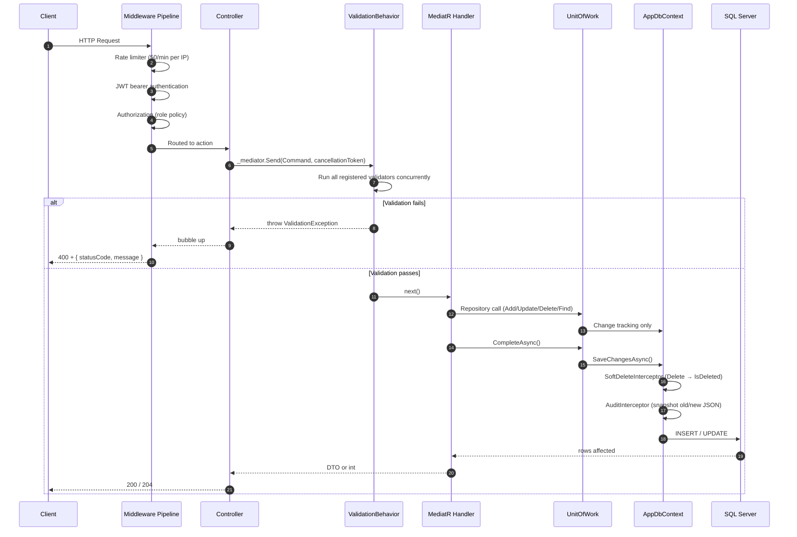
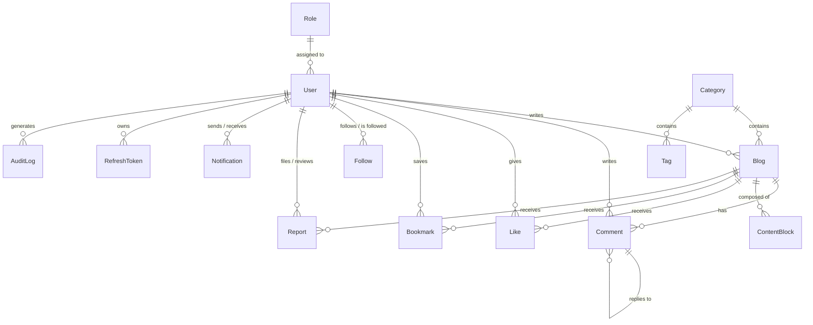
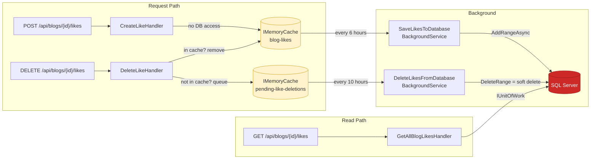
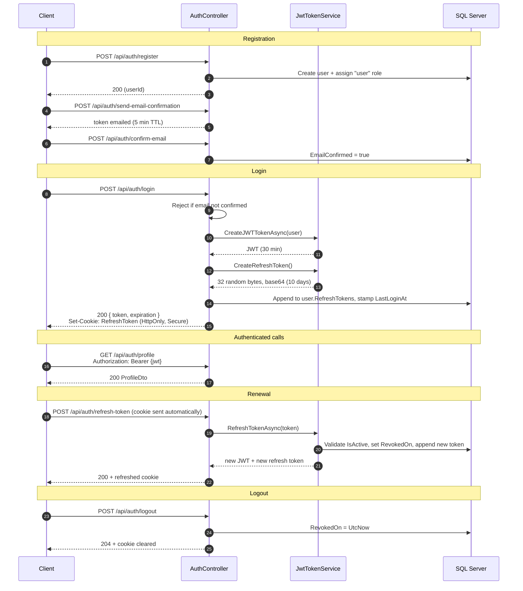

<div align="center">

# Active Blog Service

**A production-grade blogging platform API built with .NET 8, Clean Architecture and CQRS.**

Full-featured REST backend covering authoring, threaded comments, moderation, social graph,
real-time notifications and role-based administration.

[](https://dotnet.microsoft.com/download/dotnet/8.0)
[](https://learn.microsoft.com/dotnet/csharp/)
[](#architecture)
[](#database--migrations)
[](#testing)
[](#api-reference)
[](#current-state--roadmap)

[Features](#features) · [Architecture](#architecture) · [Domain Model](#domain-model) ·
[API Reference](#api-reference) · [Getting Started](#getting-started) · [Configuration](#configuration)

</div>

---

## Table of Contents

- [Overview](#overview)
- [Features](#features)
- [Architecture](#architecture)
  - [Solution Layout](#solution-layout)
  - [Layer Responsibilities](#layer-responsibilities)
  - [Request Lifecycle](#request-lifecycle)
- [Domain Model](#domain-model)
- [Application Layer](#application-layer)
  - [Use Case Inventory](#use-case-inventory)
  - [Validation Pipeline](#validation-pipeline)
  - [Response Conventions](#response-conventions)
- [Infrastructure Layer](#infrastructure-layer)
  - [Persistence](#persistence)
  - [Cross-Cutting EF Interceptors](#cross-cutting-ef-interceptors)
  - [Repository & Unit of Work](#repository--unit-of-work)
  - [Services](#services)
  - [Write-Behind Cache & Background Services](#write-behind-cache--background-services)
  - [Real-Time Notifications (SignalR)](#real-time-notifications-signalr)
- [API Reference](#api-reference)
- [Authentication & Authorization](#authentication--authorization)
- [Cross-Cutting Concerns](#cross-cutting-concerns)
- [Database & Migrations](#database--migrations)
- [Seeded Demo Data](#seeded-demo-data)
- [Testing](#testing)
- [Getting Started](#getting-started)
- [Configuration](#configuration)
- [API Documentation](#api-documentation)
- [Conventions & Contributing](#conventions--contributing)
- [Tech Stack](#tech-stack)
- [Current State & Roadmap](#current-state--roadmap)

---

## Overview

Active Blog Service is the backend for a blogging platform where authors publish structured posts,
readers engage through likes, bookmarks, follows and threaded comments, and moderators triage
user-submitted reports.

The codebase is organised as a **four-layer Clean Architecture** solution. Every user-facing
operation is modelled as a discrete **MediatR request** (command or query) handled by a single
handler, validated by FluentValidation, and executed against SQL Server through a generic
repository behind a Unit of Work. Controllers are deliberately thin — they translate HTTP into a
message and translate the result back into a status code. Nothing else.

Two design decisions shape the rest of the system:

- **Deletion is never physical.** A `SaveChangesInterceptor` converts every `DELETE` on a
  soft-deletable entity into an `IsDeleted` flag update, and an EF global query filter hides those
  rows from every read. History is preserved by default.
- **High-frequency social actions are write-behind cached.** Likes, bookmarks and follows are
  mutated in `IMemoryCache` first and flushed to SQL Server by hosted background services, so a
  burst of engagement costs no database round trips on the request path.

---

## Features

### Content

| Feature | Description |
| --- | --- |
| **Blogs** | Create, update, delete and list posts. Ownership is enforced — only the author may mutate their own blog. |
| **Content blocks** | A blog body is an ordered list of typed blocks: `Text`, `Heading`, `Image`, `Video`, `Quote`, `Code`. Blocks are bulk-created, reordered on edit, and bulk-deleted. The `(BlogId, Order)` pair is unique. |
| **Categories** | Unique-named top-level taxonomy, admin-managed. |
| **Tags** | Sub-classification scoped to a category. `(Name, CategoryId)` is unique. |

### Engagement

| Feature | Description |
| --- | --- |
| **Threaded comments** | Self-referencing `ParentCommentId` builds reply trees. `GetCommentsOfBlog` assembles the full nested structure in memory and returns only root comments. |
| **Reply notifications** | Replying to a comment pushes a real-time SignalR notification to the parent comment's author and persists it with a deep link. |
| **Likes** | One like per user per blog (unique index). Write-behind cached. |
| **Bookmarks** | Save-for-later per user per blog (unique index). Write-behind cached. |
| **Follows** | Follower → blogger social graph (unique index). Write-behind cached. |

### Identity & Security

| Feature | Description |
| --- | --- |
| **JWT authentication** | Short-lived access tokens (30 min) with `HmacSha256` signing and zero clock skew. |
| **Refresh token rotation** | Long-lived refresh tokens (10 days) stored as an EF owned collection on the user, delivered in an `HttpOnly` + `Secure` cookie, rotated on every refresh, revoked on logout. |
| **Email confirmation** | Registration issues a confirmation token by email; login is refused until the address is confirmed. Data-protection tokens expire after 5 minutes. |
| **Password reset & change** | Token-based reset for forgotten passwords, old-password-verified change for authenticated users. |
| **Role management** | ASP.NET Core Identity with `Guid` keys. Admin-only endpoints for creating roles, assigning and revoking them. |
| **Rate limiting** | Fixed-window limiter partitioned per client IP — 50 requests/minute. |

### Moderation & Observability

| Feature | Description |
| --- | --- |
| **Reports** | Users flag blogs with a reason (`Spam`, `Harassment`, `HateSpeech`, `Violence`, `SexualContent`, `Copyright`, `Misinformation`, `Other`). Admins transition reports `Pending → Resolved \| Rejected`; terminal states are immutable and no-op updates are rejected. |
| **Notifications inbox** | Per-user notification list with read/unread state and deep links. |
| **Contact admin** | Authenticated users can email the admin inbox through the API. |
| **Soft delete** | Global, interceptor-driven, on 10 entities. |
| **Audit log** | A second interceptor records before/after JSON snapshots of tracked changes into an `AuditLogs` table. |
| **Structured logging** | Serilog with request logging middleware, configured entirely from `appsettings.json`. |
| **Global exception handling** | One `IExceptionHandler` maps domain exceptions to HTTP status codes. |

### Developer Experience

| Feature | Description |
| --- | --- |
| **Scalar + Swagger** | Two interactive API explorers, both wired to the same OpenAPI document with XML doc comments and a JWT bearer security definition. |
| **Automatic migrations & seeding** | On startup the app applies pending EF migrations and idempotently seeds roles, an admin user, demo users, categories, tags, blogs, content blocks, comments and interactions. |
| **449 unit tests** | NUnit + Moq across controllers, handlers and validators for all 12 features. |

---

## Architecture

### Solution Layout

`Active Blog Service.sln` contains five projects. Dependencies point strictly inward — the domain
knows nothing about anything, and the API is the only composition root.



```
ActiveBlogService/
├── Active Blog Service.sln
├── CONTRIBUTING.md
├── Active Blog Service API/      # Presentation + composition root
│   ├── Controllers/               # 13 files: BaseController + 12 feature controllers
│   ├── Program.cs                 # All DI wiring and middleware pipeline
│   ├── GlobalExceptionHandler.cs  # Exception → HTTP status mapping
│   ├── appsettings.json
│   └── Properties/launchSettings.json
├── App.Application/               # Use cases (application layer)
│   ├── Auth/ Blogs/ Bookmarks/ Categories/ Comments/ ContentBlocks/
│   ├── Follows/ Likes/ Notifications/ Reports/ Roles/ Tags/
│   ├── Behaviors/                 # ValidationBehavior (MediatR pipeline)
│   ├── Common/                    # Interfaces, exceptions, validation attributes, enums
│   ├── Responses/                 # ResponseResult<T>
│   └── IApplicationMarker.cs      # Assembly anchor for MediatR/FluentValidation scanning
├── App.Domain/                    # Entities and rules (innermost layer)
│   ├── Entities/                  # 14 entities
│   ├── Enums/                     # ContentBlockType, ReportReason, ReportStatus
│   └── Interceptors/              # ISoftDeletable, IAuditLog marker interfaces
├── App.Infrastructure/            # Technical concerns
│   ├── Persistance/               # AppDbContext, 11 entity configs, DatabaseSeeder
│   ├── Interceptors/              # SoftDeleteInterceptor, AuditInterceptor
│   ├── Repositories/              # BaseRepository<T>
│   ├── UnitOfWork/                # UnitOfWork
│   ├── Services/                  # Identity, JWT, Roles, Email, Cache, Notifications, CurrentUser
│   ├── BackgroundServices/        # Write-behind flush jobs (Likes, Bookmarks, Follows)
│   ├── Hubs/                      # NotificationHub (SignalR)
│   └── Migrations/                # EF Core migrations
└── App.Test/                      # NUnit + Moq
    ├── Controllers/  Handlers/  Validators/
```

### Layer Responsibilities

| Project | Depends on | Responsibility | Not allowed to |
| --- | --- | --- | --- |
| **App.Domain** | — | Entities, enums, cross-cutting marker interfaces. Pure POCOs plus `IdentityUser`/`IdentityRole` bases. | Reference anything. Contain business logic. |
| **App.Application** | `App.Domain` | Use cases as MediatR commands/queries, their handlers, FluentValidation validators, DTOs, and the **interfaces** the infrastructure must satisfy. | Touch EF Core, HTTP, or any concrete technology. |
| **App.Infrastructure** | `App.Application` | Implements every application interface: `AppDbContext`, entity configurations, `BaseRepository<T>`, `UnitOfWork`, interceptors, Identity/JWT/role/email/cache services, SignalR hub, background jobs, seeder. | Contain use-case logic. |
| **Active Blog Service API** | `App.Application`, `App.Infrastructure` | Controllers, the middleware pipeline, all DI registration, global exception handling, Swagger/Scalar, rate limiting. | Contain business logic. |
| **App.Test** | API, Application | Unit tests for controllers, handlers and validators. | — |

The **dependency rule** is enforced by project references: `App.Application` declares interfaces
(`IUnitOfWork`, `IBaseRepository<T>`, `IIdentityService`, `IJwtTokenService`, `IMemoryService<T>`,
`INotificationService`, `IContactService`, `ICurrentUserService`, `IRoleService`) and
`App.Infrastructure` implements them. The application layer has no idea SQL Server exists.

> Every infrastructure service interface extends an empty `IScopedServiceMarker`. `Program.cs` uses
> **Scrutor** to scan the assembly and register all implementations as scoped services in one call,
> so adding a new service requires no manual registration.

### Request Lifecycle



---

## Domain Model

Fourteen entities in `App.Domain/Entities`. There is **no shared base class** — each entity
declares its own `Guid Id` and audit fields, and opts into cross-cutting behaviour by implementing
marker interfaces from `App.Domain/Interceptors`:

- `ISoftDeletable` → `bool IsDeleted`, `DateTime DeletedAt`
- `IAuditLog` → empty marker consumed by the audit interceptor



| Entity | Base | Soft delete | Audited | Key properties | Relationships |
| --- | --- | :---: | :---: | --- | --- |
| `User` | `IdentityUser<Guid>` | — | ✅ | `FName`, `LName`, `Image?`, `Address?`, `IsActive`, `LastLoginAt`, `CreatedAt`, `UpdatedAt?` | 12 collections: refresh tokens, blogs, comments, likes, follows (both directions), bookmarks, reports (both directions), notifications (both directions), audit logs |
| `Role` | `IdentityRole<Guid>` | — | — | `RoleDescription?` | Users via Identity join table |
| `Blog` | — | ✅ | ✅ | `Title`, `Image?`, `CategoryId`, `UserId`, timestamps | `User`, `Category`, comments, content blocks, likes, bookmarks, reports |
| `Category` | — | ✅ | ✅ | `CategoryName` (**unique index**) | Blogs, tags |
| `Tag` | — | ✅ | ✅ | `Name`, `CategoryId` — `(Name, CategoryId)` **unique** | `Category` |
| `Comment` | — | ✅ | ✅ | `CommentContent`, `BlogId`, `UserId`, `ParentCommentId?` | `Blog`, `User`, self-referencing `ParentComment` / `Replies` |
| `ContentBlock` | — | ✅ | ✅ | `Type` (`ContentBlockType`), `Data`, `Order` — `(BlogId, Order)` **unique** | `Blog` |
| `Like` | — | ✅ | ✅ | `BlogId`, `UserId`, `CreatedAt` — `(UserId, BlogId)` **unique** | `Blog`, `User` |
| `Bookmark` | — | ✅ | ✅ | `BlogId`, `UserId`, `CreatedAt` — `(UserId, BlogId)` **unique** | `Blog`, `User` |
| `Follow` | — | ✅ | ✅ | `BloggerId`, `FollowerId` — `(FollowerId, BloggerId)` **unique** | `Blogger`, `Follower` |
| `Report` | — | ✅ | ✅ | `Reason` (`ReportReason`), `Description?`, `Status` (`ReportStatus`), `BlogId`, `ReporterId`, `ReviewerId?`, `ReviewedAt?` | `Blog`, `Reporter`, `Reviewer` |
| `Notification` | — | ✅ | ✅ | `SenderId`, `ReceiverId`, `Message`, `IsRead`, `Link?` | `Sender`, `Receiver` |
| `RefreshToken` | `[Owned]` | — | — | `Token`, `ExpiresOn`, `CreatedOn`, `RevokedOn?`; computed `IsExpired`, `IsActive` | Owned collection on `User` → table `RefreshToken` |
| `AuditLog` | — | — | — | `UserId?`, `Action`, `EntityName`, `EntityId`, `OldValues?` (JSON), `NewValues?` (JSON), `CreatedAt` | `User` |

### Enums

| Enum | Members |
| --- | --- |
| `ContentBlockType` | `Text`, `Heading`, `Image`, `Video`, `Quote`, `Code` |
| `ReportReason` | `Spam`, `Harassment`, `HateSpeech`, `Violence`, `SexualContent`, `Copyright`, `Misinformation`, `Other` |
| `ReportStatus` | `Pending`, `Rejected`, `Resolved` |
| `SortDirection` *(App.Application)* | `Ascending = 1`, `Descending = 2` |

All three domain enums are persisted as **strings** via EF value converters and serialised as
**strings** at the API edge via `JsonStringEnumConverter`.

---

## Application Layer

`App.Application` holds **57 use cases** (commands + queries), each in its own folder alongside
its handler and validator:

```
Blogs/Commands/CreateBlog/
├── CreateBlogCommand.cs      # record : IRequest<int>
├── CreateBlogHandler.cs      # IRequestHandler<CreateBlogCommand, int>
└── CreateBlogValidator.cs    # AbstractValidator<CreateBlogCommand>
```

Handlers use **C# primary-constructor injection**, log an `operation started` / `operation
completed` pair, and return either a DTO, a `bool`, an `IdentityResult`, or an `int` representing
rows affected from `IUnitOfWork.CompleteAsync()`. Failures are signalled by throwing —
`NotFoundException`, `ForbiddenException` or `ArgumentException` — which the API's global handler
converts to a status code.

There is **no mapping library**. All entity ↔ DTO translation is explicit, either as LINQ
`.Select()` projections inside queries or object initialisers inside handlers. Update handlers use
null-coalescing field patching (`request.Title ?? existing.Title`) so a partial body only touches
the supplied fields.

### Use Case Inventory

<details>
<summary><b>Auth — 11 use cases</b></summary>

| Use case | Type | Returns | Behaviour |
| --- | --- | --- | --- |
| `RegisterCommand` | Command | `Guid` | Creates the user (`UserName = Email`), ensures the `user` role exists, assigns it. |
| `LoginCommand` | Command | `LoginDto` | Validates credentials, refuses unconfirmed emails, issues a JWT plus a refresh token, stamps `LastLoginAt`. |
| `LogoutCommand` | Command | `ResponseResult<bool>` | Revokes the presented refresh token. |
| `RefreshTokenCommand` | Command | `ResponseResult<RefreshTokenDto>` | Validates and rotates the refresh token, issues a new JWT. |
| `ConfirmEmailCommand` | Command | `IdentityResult` | Verifies the confirmation token and sets `EmailConfirmed`. |
| `SendEmailConfirmationCommand` | Command | `NotifyDto` | Generates and emails a confirmation token (5-minute lifespan). |
| `ForgetPasswordCommand` | Command | `NotifyDto` | Generates and emails a password-reset token. |
| `ResetPasswordCommand` | Command | `bool` | Resets the current user's password using the token. |
| `ChangePasswordCommand` | Command | `bool` | Changes the current user's password after verifying the old one. |
| `EditProfileCommand` | Command | `IdentityResult` | Partial update of name, email, phone, address, image; optional password change. |
| `GetProfileQuery` | Query | `ProfileDto?` | Reads the current user's profile. |

</details>

<details>
<summary><b>Blogs — 5 use cases</b></summary>

| Use case | Type | Returns | Behaviour |
| --- | --- | --- | --- |
| `CreateBlogCommand` | Command | `int` | Requires an authenticated user; stamps `UserId`. |
| `UpdateBlogCommand` | Command | `int` | Ownership check → `ForbiddenException`; null-coalescing patch + `UpdatedAt`. |
| `DeleteBlogCommand` | Command | `int` | Ownership check → soft delete via interceptor. |
| `GetAllBlogsQuery` | Query | `List<BlogDetailsDto>` | Includes the author; projects a composite `UserName`. |
| `GetBlogByIdQuery` | Query | `BlogDetailsDto?` | `NotFoundException` when missing. |

</details>

<details>
<summary><b>Content Blocks — 4 use cases</b></summary>

| Use case | Type | Returns | Behaviour |
| --- | --- | --- | --- |
| `CreateContentBlocksCommand` | Command | `int` | Bulk insert with sequential `Order` starting at 1. |
| `EditContentBlocksCommand` | Command | `int` | Reassigns `Order` (reordering) and replaces `Data`; rejects URLs in non-media blocks. |
| `DeleteContentBlocksCommand` | Command | `int` | Bulk soft delete by id set. |
| `GetAllContentBlocksOfBlogQuery` | Query | `List<ContentBlockDto>` | All blocks for a blog. |

The validator enforces type-specific rules: `Content` is required for `Text`/`Quote`/`Heading`/
`Code` and must be a valid absolute `http`/`https` URL for `Image`/`Video`.

</details>

<details>
<summary><b>Comments — 5 use cases</b></summary>

| Use case | Type | Returns | Behaviour |
| --- | --- | --- | --- |
| `CreateCommentCommand` | Command | `int` | Validates the parent comment when replying, then pushes a SignalR notification to the parent's author with a deep link. |
| `UpdateCommentCommand` | Command | `int` | Edits `CommentContent` and stamps `UpdatedAt`. |
| `DeleteCommentCommand` | Command | `int` | Soft delete. |
| `GetCommentsOfBlogQuery` | Query | `List<CommentDto>` | Loads comments newest-first, builds an in-memory dictionary and assembles a **nested reply tree**, returning only root comments. |
| `GetCommentByIdQuery` | Query | `GetCommentDto` | Flat projection of a single comment. |

</details>

<details>
<summary><b>Likes · Bookmarks · Follows — 10 use cases</b></summary>

These three features share the same write-behind cache shape and never touch the database on the
write path.

| Use case | Type | Returns | Behaviour |
| --- | --- | --- | --- |
| `CreateLikeCommand` | Command | *(none)* | Removes the user from `pending-like-deletions`, adds them to `blog-likes[blogId]`. |
| `DeleteLikeCommand` | Command | *(none)* | Removes from `blog-likes`; if absent, queues under `pending-like-deletions`. |
| `GetAllBlogLikesQuery` | Query | `List<LikeDto>` | Reads persisted rows for a blog. |
| `CreateBookmarkCommand` | Command | *(none)* | Same shape on `blog-bookmarks`. |
| `DeleteBookmarkCommand` | Command | *(none)* | Same shape on `pending-bookmark-deletions`. |
| `GetAllBookmarksOfUserQuery` | Query | `List<BookmarkDto>` | Reads persisted rows for the current user. |
| `CreateFollowCommand` | Command | *(none)* | Same shape on `blog-follows[bloggerId]`. |
| `DeleteFollowCommand` | Command | *(none)* | Same shape on `pending-follow-deletions`. |
| `GetAllFollowersQuery` | Query | `List<UserDto>` | Resolves follower ids to users via `IIdentityService`. |
| `GetAllFollowingsQuery` | Query | `List<UserDto>` | Same, for the blogger side. |

See [Write-Behind Cache & Background Services](#write-behind-cache--background-services).

</details>

<details>
<summary><b>Categories & Tags — 10 use cases</b></summary>

| Use case | Type | Returns | Behaviour |
| --- | --- | --- | --- |
| `CreateCategoryCommand` | Command | `int` | Insert; unique name enforced at the DB level. |
| `UpdateCategoryCommand` | Command | `int` | `NotFoundException` when missing; renames + `UpdatedAt`. |
| `DeleteCategoryCommand` | Command | `int` | Soft delete. |
| `GetAllCategoriesQuery` | Query | `List<CategoryDetailsDto>` | All categories. |
| `GetCategoryByIdQuery` | Query | `CategoryDetailsDto?` | `NotFoundException` when missing. |
| `CreateTagCommand` | Command | `int` | Verifies the parent category exists first. |
| `UpdateTagCommand` | Command | `int` | Null-coalescing name; keeps the category when `Guid.Empty` is sent. |
| `DeleteTagCommand` | Command | `int` | Soft delete. |
| `GetAllTagsOfCategoryQuery` | Query | `List<TagDetailsDto>` | All tags under a category. |
| `GetTagByIdQuery` | Query | `TagDetailsDto?` | Single tag. |

</details>

<details>
<summary><b>Reports — 4 use cases</b></summary>

| Use case | Type | Returns | Behaviour |
| --- | --- | --- | --- |
| `CreateReportCommand` | Command | `int` | Files a report with `Status = Pending` and the current user as reporter. |
| `UpdateReportCommand` | Command | `int` | Admin review. Rejects no-op transitions, refuses to mutate already `Resolved`/`Rejected` reports, stamps `ReviewerId` and `ReviewedAt`. |
| `GetReportByIdQuery` | Query | `ReportDto` | `NotFoundException` when missing. |
| `GetReportsQuery` | Query | `List<ReportDto>` | Moderation queue. |

</details>

<details>
<summary><b>Notifications — 3 use cases</b></summary>

| Use case | Type | Returns | Behaviour |
| --- | --- | --- | --- |
| `MakeNotificationReadCommand` | Command | `int` | Flips `IsRead`. |
| `NotifyAdminMailCommand` | Command | `NotifyDto` | Emails the admin inbox with the sender's identity, subject and message. |
| `GetUserNotificationsQuery` | Query | `List<UserNotificationDto>` | Inbox for the current user. |

</details>

<details>
<summary><b>Roles — 5 use cases</b></summary>

| Use case | Type | Returns | Behaviour |
| --- | --- | --- | --- |
| `CreateRoleCommand` | Command | `IdentityResult` | Lowercases the name and creates the role with a description. |
| `DeleteRoleCommand` | Command | `bool` | `NotFoundException` when missing. |
| `AssignRoleCommand` | Command | `IdentityResult` | Verifies both role and user exist, then assigns. |
| `DeleteAssignRoleCommand` | Command | `bool` | Revokes a role from a user. |
| `GetAllRolesQuery` | Query | `List<RoleDto>` | Lists all roles. |

</details>

### Validation Pipeline

`App.Application/Behaviors/ValidationBehavior.cs` is a MediatR `IPipelineBehavior` registered
open-generically, so it wraps **every** request:

1. If no `IValidator<TRequest>` is registered → short-circuit to the handler.
2. Build one `ValidationContext<TRequest>` and run all validators **concurrently** via
   `Task.WhenAll`.
3. Flatten every `ValidationFailure`.
4. If any failures exist → throw FluentValidation's `ValidationException` carrying the full list.
   The handler never runs.
5. Otherwise → `await next()`.

47 validator classes cover the write side of the API. Beyond length and format rules, three custom
`ValidationAttribute`s in `App.Application/Common/ValidationAttributes` handle concerns that need
services or file metadata:

| Attribute | Purpose |
| --- | --- |
| `UniqueEmail` | Resolves `IIdentityService` from the validation context and rejects an already-registered email. |
| `CheckImageExtension` | Restricts `IFormFile` uploads to `.jpg`, `.jpeg`, `.png`. |
| `CheckImageSize` | Caps `IFormFile` uploads at a configurable size (default 5 MB). |

Domain-specific validation also lives in validators — for example `CreateContentBlocksValidator`
uses `RuleForEach` with `ChildRules` to require content for text-like blocks and a valid absolute
URL for media blocks.

### Response Conventions

Controllers follow one consistent contract:

| Outcome | Status | Body |
| --- | --- | --- |
| Success with a resource | `200 OK` | DTO or list |
| Success, no content | `204 No Content` | — |
| Query returned an empty list | `204 No Content` | — |
| Rows affected `== 0` on a mutation | `400 Bad Request` | Message |
| Business/domain failure | `400` / `403` / `404` | Message |
| Unhandled exception | `500 Internal Server Error` | `"An unexpected error occurred."` |

Every action is decorated with `[ProducesResponseType(typeof(...), StatusCodes.Status...)]` and
documented with XML `<summary>` / `<param>` / `<returns>` comments, which Swagger and Scalar both
render.

`App.Application/Responses/ResponseResult<T>` is the explicit result wrapper —
`IsSuccess`, `Value`, `Errors`, plus `Success(value)` and `Failure(params string[])` factories. It
is used on the token endpoints; elsewhere handlers return bare values and throw on failure.

---

## Infrastructure Layer

### Persistence

`App.Infrastructure/Persistance/AppDbContext.cs` inherits
`IdentityDbContext<User, Role, Guid>`, exposing 11 `DbSet`s on top of the Identity tables. It
contains no inline configuration — `OnModelCreating` calls
`ApplyConfigurationsFromAssembly`, picking up all 11 `IEntityTypeConfiguration<T>` classes from
`Persistance/Config/`.

Every configuration follows the same template:

- `Guid` primary key, `ValueGeneratedOnAdd`
- A **global query filter** `HasQueryFilter(x => !x.IsDeleted)` on all 10 soft-deletable entities
- Unique composite indexes where the domain forbids duplicates
- `DeleteBehavior.Restrict` on user-facing foreign keys, so deleting a user never cascades away
  their content
- Enum → string value converters for `ContentBlock.Type`, `Report.Status`, `Report.Reason`

`RefreshToken` carries `[Owned]` and is mapped by EF as an **owned collection** on `User`,
producing a `RefreshToken` table with a composite key.

The context is registered with **resilient connections**:

```csharp
options.UseSqlServer(config.GetConnectionString("constr"),
    sql => sql.EnableRetryOnFailure(maxRetryCount: 5,
                                    maxRetryDelay: TimeSpan.FromSeconds(10),
                                    errorNumbersToAdd: null));
options.AddInterceptors(sp.GetRequiredService<SoftDeleteInterceptor>());
options.AddInterceptors(sp.GetRequiredService<AuditInterceptor>());
```

### Cross-Cutting EF Interceptors

**`SoftDeleteInterceptor`** — on `SavingChangesAsync`, finds every tracked `ISoftDeletable` in
`EntityState.Deleted`, flips it to `Modified`, and sets `IsDeleted = true` /
`DeletedAt = DateTime.UtcNow`. Combined with the global query filters, this makes physical deletes
impossible through the normal path and invisible reads automatic — handlers just call
`repository.Delete(entity)` and never think about it again.

**`AuditInterceptor`** — injects `ICurrentUserService`, and on `SavingChangesAsync` captures every
tracked `IAuditLog` entity in `Added`, `Modified` or `Deleted` state. It serialises
`entry.OriginalValues` and `entry.CurrentValues` to JSON and inserts an `AuditLog` row carrying the
acting user id, the EF state as `Action`, the entity name, the entity id, and both value snapshots.
The audit row is added to the **same** `DbContext`, so it commits in the same transaction as the
change it describes.

### Repository & Unit of Work

`BaseRepository<T>` is the single generic repository — there are no per-entity specialisations. It
takes `AppDbContext` by primary-constructor injection and works against `_context.Set<T>()`, so one
class serves all 11 aggregates.

| Category | Methods |
| --- | --- |
| Reads | `GetAllAsync` (the only `AsNoTracking` query), `GetByIdAsync`, `FindAsync(criteria)`, `FindAsync(criteria, includes[])`, and four `FindAllAsync` overloads combining criteria, includes, `SortDirection` and an `orderBy` expression |
| Writes | `AddAsync`, `AddRangeAsync` |
| Staging | `Update`, `UpdateRange`, `Delete`, `DeleteRange` — synchronous, change-tracker only |

The repository **never calls `SaveChanges`**. `UnitOfWork` is the sole commit point: it eagerly
constructs the 11 repositories, exposes them as typed properties, and offers exactly one method —
`CompleteAsync(CancellationToken)` → `_context.SaveChangesAsync()`, returning rows affected. That
return value is what most command handlers hand back to the controller, which is why a `0` becomes
a `400`.

### Services

All seven services live in `App.Infrastructure/Services`, implement an interface marked with
`IScopedServiceMarker`, and are registered as **scoped** by a single Scrutor scan.

| Service | Implements | Responsibility |
| --- | --- | --- |
| `IdentityService` | `IIdentityService` | Thin wrapper over `UserManager<User>`: create/update/get users, batch-fetch by ids, email-uniqueness check, password correctness, and generation/verification of email-confirmation and password-reset tokens. |
| `RoleService` | `IRoleService` | Wraps `RoleManager<Role>` + `UserManager<User>`: list roles, existence check, create with description, assign to and revoke from a user, delete. |
| `JwtTokenService` | `IJwtTokenService` | Issues JWTs (`NameIdentifier`, `Name`, `Jti`, `IsActive`, one `Role` claim per role) signed `HmacSha256`; generates cryptographically random refresh tokens via `RandomNumberGenerator.GetBytes(32)`; implements rotation and revocation; parses claims out of a bearer header. |
| `MemoryService<T>` | `IMemoryService<T>` | Generic wrapper over `IMemoryCache` — `GetObject`, `SetObject`, `RemoveObject`. The backbone of the write-behind pattern. |
| `CurrentUserService` | `ICurrentUserService` | Reads `ClaimTypes.NameIdentifier` from `IHttpContextAccessor` and parses it into `Guid? UserId`. Consumed by handlers for ownership checks and by the audit interceptor. |
| `NotificationService` | `INotificationService` | Pushes `"newMessage"` to a specific SignalR user, then persists a `Notification` row through the Unit of Work. |
| `ContactService` | `IContactService` | Sends mail via **MailKit**/MimeKit over SMTP. `SendEmailServiceAsync` for arbitrary recipients, `SendEmailToAdminServiceAsync` for the contact-admin flow (sets `From` to the admin address and `ReplyTo` to the sender). Returns a `NotifyDto` rather than throwing. |

### Write-Behind Cache & Background Services

Likes, bookmarks and follows are the highest-frequency, lowest-value writes in the system. Rather
than hitting SQL Server on every click, they are buffered in `IMemoryCache` and flushed in bulk.



Each handler creates its own DI scope per iteration, does the bulk write, then removes the cache
key. The pattern is symmetric across all three features:

| Feature | Buffer key | Deletion queue key | Save job | Delete job |
| --- | --- | --- | --- | --- |
| Likes | `blog-likes` | `pending-like-deletions` | every 6 h | every 10 h |
| Bookmarks | `blog-bookmarks` | `pending-bookmark-deletions` | every 6 h | every 10 h |
| Follows | `blog-follows` | `pending-follow-deletions` | every 6 h | every 10 h |

Cache payloads are all `Dictionary<Guid, HashSet<Guid>>` — entity id → set of user ids (for
follows, blogger id → follower ids). A create cancels a pending delete for the same user, and a
delete only queues database work when the row was not in the buffer.

**Consistency model.** This is deliberate **eventual consistency**:

- The read queries go straight to SQL Server and do not merge the cache, so a like is invisible to
  `GET` until the next flush.
- `IMemoryCache` is process-local with no expiration policy, so an app restart or recycle discards
  every unflushed interaction.
- Only the two **Likes** jobs are currently registered in `Program.cs`
  (`SaveLikesToDatabaseBackgroundService`, `DeleteLikesFromDatabaseBackgroundService`). The four
  bookmark and follow jobs exist but are not wired up, so those buffers never flush. See
  [Current State & Roadmap](#current-state--roadmap).

### Real-Time Notifications (SignalR)

`App.Infrastructure/Hubs/NotificationHub` is an empty `Hub` — it exists purely as a connection
endpoint and user-identifier provider, mapped at **`/notify`**:

```csharp
app.MapHub<NotificationHub>("/notify");
```

All traffic is **server-initiated**. `NotificationService.NotifyUserAsync` pushes to
`Clients.User(receiverId.ToString())` with the event name `"newMessage"` and payload
`(string message, Guid sender)`, then persists the `Notification` row. SignalR's default
`IUserIdProvider` reads `ClaimTypes.NameIdentifier`, which `JwtTokenService` emits — so the
pairing works as long as the client presents the JWT on the negotiate request.

Currently triggered by the comment-reply flow: replying to someone's comment notifies them with a
deep link of the form `api/comments/{commentId}`.

---

## API Reference

**57 endpoints** across 12 feature controllers. All controllers derive from `BaseController`
(`[Route("api")]`, `[ApiController]`), which exposes `protected readonly ISender _mediator`.

Legend — 🔓 anonymous · 🔑 any authenticated user · 🛡️ `admin` role required

### Auth — `AuthController`

| Method | Route | Access | Description |
| --- | --- | :---: | --- |
| `POST` | `/api/auth/register` | 🔓 | Register a new account. Auto-assigns the `user` role. Returns the new user id. |
| `POST` | `/api/auth/login` | 🔓 | Authenticate. Returns the JWT and sets the refresh token in an `HttpOnly` + `Secure` cookie. |
| `POST` | `/api/auth/refresh-token` | 🔓 | Rotate the refresh token from the cookie and issue a new JWT. |
| `POST` | `/api/auth/logout` | 🔑 | Revoke the refresh token and clear the cookie. `204` when no cookie is present. |
| `GET` | `/api/auth/profile` | 🔑 | Current user's profile. |
| `PUT` | `/api/auth/profile` | 🔑 | Partial profile update; may include a password change. |
| `POST` | `/api/auth/send-email-confirmation` | 🔓 | Email a confirmation token (5-minute lifespan). |
| `POST` | `/api/auth/confirm-email` | 🔓 | Confirm an email address with the token. |
| `POST` | `/api/auth/change-password` | 🔑 | Change password after verifying the current one. |
| `POST` | `/api/auth/forget-password` | 🔓 | Email a password-reset token. |
| `POST` | `/api/auth/reset-password` | 🔓 | Reset the password with the token. |

### Blogs — `BlogController`

| Method | Route | Access | Description |
| --- | --- | :---: | --- |
| `GET` | `/api/blogs` | 🔓 | List all blogs with author details. |
| `GET` | `/api/blogs/{id:guid}` | 🔓 | Single blog. |
| `POST` | `/api/blogs` | 🔑 | Create a blog. |
| `PUT` | `/api/blogs/{id:guid}` | 🔑 | Update a blog (author only). |
| `DELETE` | `/api/blogs/{id:guid}` | 🔑 | Soft-delete a blog (author only). |

### Content Blocks — `ContentBlockController`

| Method | Route | Access | Description |
| --- | --- | :---: | --- |
| `GET` | `/api/blogs/{id:guid}/content-blocks` | 🔑 | All ordered blocks of a blog. |
| `POST` | `/api/blogs/{id:guid}/content-blocks` | 🔑 | Bulk-create blocks; `Order` assigned sequentially from 1. |
| `PATCH` | `/api/blogs/{id:guid}/content-blocks` | 🔑 | Bulk-edit content and re-order blocks. |
| `DELETE` | `/api/blogs/{id:guid}/content-blocks` | 🔑 | Bulk soft-delete by id set (body required). |

### Comments — `CommentController`

| Method | Route | Access | Description |
| --- | --- | :---: | --- |
| `GET` | `/api/blogs/{id:guid}/comments` | 🔓 | Nested comment tree for a blog (roots with `Replies`). |
| `GET` | `/api/comments/{id:guid}` | 🔓 | Single comment, flat. |
| `POST` | `/api/blogs/{id:guid}/comments` | 🔑 | Comment, or reply when `ParentCommentId` is supplied. Notifies the parent's author. |
| `PUT` | `/api/blogs/{id:guid}/comments` | 🔑 | Edit a comment. `{id}` is the **comment** id; the blog id travels in the body. |
| `DELETE` | `/api/blogs/{id:guid}/comments` | 🔑 | Soft-delete a comment (body required). |

### Likes — `BlogLikeController`

| Method | Route | Access | Description |
| --- | --- | :---: | --- |
| `GET` | `/api/blogs/{id:guid}/likes` | 🛡️ | Persisted likes for a blog. |
| `POST` | `/api/blogs/{id:guid}/likes` | 🔑 | Like (write-behind cache, always `204`). |
| `DELETE` | `/api/blogs/{id:guid}/likes` | 🔑 | Unlike (write-behind cache, always `204`). |

### Bookmarks — `BookmarkController`

| Method | Route | Access | Description |
| --- | --- | :---: | --- |
| `GET` | `/api/user/bookmarks` | 🔑 | Current user's persisted bookmarks. |
| `POST` | `/api/blogs/{id:guid}/bookmark` | 🔑 | Bookmark (write-behind cache, always `204`). |
| `DELETE` | `/api/blogs/{id:guid}/bookmark` | 🔑 | Remove bookmark (write-behind cache, always `204`). |

### Follows — `FollowController`

| Method | Route | Access | Description |
| --- | --- | :---: | --- |
| `GET` | `/api/followers` | 🔑 | Followers list. |
| `GET` | `/api/bloggers` | 🔑 | Followed bloggers list. |
| `POST` | `/api/follows/bloggers/{id:guid}` | 🔑 | Follow a blogger (write-behind cache, always `204`). |
| `DELETE` | `/api/follows/bloggers/{id:guid}` | 🔑 | Unfollow (write-behind cache, always `204`). |

### Categories — `CategoryController`

| Method | Route | Access | Description |
| --- | --- | :---: | --- |
| `GET` | `/api/categories` | 🔓 | List all categories. |
| `GET` | `/api/categories/{id:guid}` | 🛡️ | Single category. |
| `POST` | `/api/categories` | 🛡️ | Create a category. |
| `PUT` | `/api/categories/{id:guid}` | 🛡️ | Rename a category. |
| `DELETE` | `/api/categories/{id:guid}` | 🛡️ | Soft-delete a category. |

### Tags — `TagController`

| Method | Route | Access | Description |
| --- | --- | :---: | --- |
| `GET` | `/api/tags/category/{id:guid}` | 🔓 | All tags under a category. |
| `POST` | `/api/tags/category/{id:guid}` | 🛡️ | Create a tag in a category. |
| `GET` | `/api/tags/{id:guid}` | 🛡️ | Single tag. |
| `PUT` | `/api/tags/{id:guid}` | 🛡️ | Update a tag's name and/or category. |
| `DELETE` | `/api/tags/{id:guid}` | 🛡️ | Soft-delete a tag. |

### Reports — `ReportController`

| Method | Route | Access | Description |
| --- | --- | :---: | --- |
| `POST` | `/api/blogs/{id:guid}/reports` | 🔑 | File a report against a blog. |
| `GET` | `/api/reports` | 🛡️ | Moderation queue. |
| `GET` | `/api/reports/{id:guid}` | 🛡️ | Single report. |
| `PUT` | `/api/reports/{id:guid}` | 🛡️ | Transition `Pending → Resolved \| Rejected`. |

### Notifications — `NotificationController`

| Method | Route | Access | Description |
| --- | --- | :---: | --- |
| `GET` | `/api/user/notifications` | 🔑 | Current user's inbox. |
| `PATCH` | `/api/notifications/{id:guid}` | 🔑 | Mark a notification read. |
| `POST` | `/api/contact` | 🔑 | Send a message to the admin inbox. |

### Roles — `RoleController`

| Method | Route | Access | Description |
| --- | --- | :---: | --- |
| `GET` | `/api/roles` | 🛡️ | List all roles. |
| `POST` | `/api/roles` | 🛡️ | Create a role. |
| `DELETE` | `/api/roles` | 🛡️ | Delete a role (body required). |
| `POST` | `/api/roles/users` | 🛡️ | Assign a role to a user by email. |
| `DELETE` | `/api/roles/users` | 🛡️ | Revoke a role from a user (body required). |

### Real-Time

| Method | Route | Description |
| --- | --- | --- |
| WebSocket | `/notify` | SignalR hub. Server pushes the `newMessage` event with `(message, senderId)`. |

---

## Authentication & Authorization



**Access token claims** issued by `JwtTokenService`:

| Claim | Value |
| --- | --- |
| `ClaimTypes.NameIdentifier` | User `Guid` — also the SignalR user id |
| `ClaimTypes.Name` | `UserName ?? Email ?? ""` |
| `JwtRegisteredClaimNames.Jti` | New `Guid` per token |
| `IsActive` | Custom flag from the user record |
| `ClaimTypes.Role` | One claim per assigned role |

Validation is strict: issuer, audience, signing key and lifetime are all checked, and
`ClockSkew = TimeSpan.Zero` means an expired token is rejected immediately.

**Authorization** is applied at both class and action level. `[Authorize(Roles = "admin")]` guards
categories, tags, roles, reports and the likes read endpoint. `[AllowAnonymous]` overrides the
class-level policy for public reads (blog list, blog detail, category list, comment threads, tag
browsing) and the whole auth flow.

**Identity password policy** (configured in `Program.cs`):

| Rule | Value |
| --- | --- |
| Minimum length | 8 |
| Unique characters | 4 |
| Digit required | yes |
| Lowercase required | yes |
| Uppercase required | yes |
| Non-alphanumeric required | no |

FluentValidation adds a domain rule on top: registered emails must be `@gmail.com`, `@yahoo.com`
or `@hotmail.com`; phone numbers must match the Egyptian format `^01[0125]\d{8}$`.

---

## Cross-Cutting Concerns

### Exception Handling

`GlobalExceptionHandler` implements `IExceptionHandler` (registered with `AddProblemDetails()` and
activated by `app.UseExceptionHandler()`). It logs every exception at `Error` level first, then
maps it:

| Exception | Status |
| --- | --- |
| `NotFoundException` | `404` |
| `ForbiddenException` | `403` |
| `UnauthorizedAccessException` | `401` |
| `ArgumentException`, FluentValidation `ValidationException` | `400` |
| anything else | `500` |

The body is a consistent two-property object:

```json
{ "statusCode": 404, "message": "Blog is not found." }
```

For `500`s the message is always `"An unexpected error occurred."` so internals never leak.

### Rate Limiting

A global partitioned limiter, hardcoded in `Program.cs`:

```csharp
options.GlobalLimiter = PartitionedRateLimiter.Create<HttpContext, string>(context =>
    RateLimitPartition.GetFixedWindowLimiter(
        partitionKey: context.Connection.RemoteIpAddress?.ToString() ?? "unknown",
        factory: _ => new FixedWindowRateLimiterOptions
        {
            PermitLimit = 50,
            Window = TimeSpan.FromMinutes(1)
        }));
```

50 requests per minute per client IP, fixed window, rejected with `503`.

### Logging

Serilog is bootstrapped early (`CreateBootstrapLogger`) so startup failures are captured, then
reconfigured from both `appsettings.json` and the DI container:

```csharp
builder.Services.AddSerilog((services, lc) =>
    lc.ReadFrom.Configuration(config)
      .ReadFrom.Services(services)
      .Enrich.FromLogContext());
```

`app.UseSerilogRequestLogging()` logs every request. `Log.CloseAndFlushAsync()` runs in a `finally`
block around the whole pipeline so nothing is lost on shutdown. Framework noise is dialled down to
`Warning` for `Microsoft.AspNetCore` and `Microsoft.EntityFrameworkCore`; application code logs at
`Information`. Handlers additionally log an explicit start/complete pair.

### Middleware Pipeline

Order matters, and this is the exact sequence in `Program.cs`:

```
MapSwagger  →  MapScalarApiReference  →  UseRateLimiter  →  UseExceptionHandler
→  UseSerilogRequestLogging  →  UseHttpsRedirection  →  UseAuthentication
→  UseAuthorization  →  MapControllers  →  MapHub<NotificationHub>("/notify")
→  DatabaseSeeder.SeedAsync  →  app.Run()
```

The rate limiter runs before authentication so abusive traffic is shed cheaply, and the exception
handler sits inside it so limiter rejections are not themselves intercepted.

---

## Database & Migrations

- **Provider:** SQL Server via `Microsoft.EntityFrameworkCore.SqlServer` 8.0.8
- **Approach:** Code First
- **Migrations:** `App.Infrastructure/Migrations` — `20261004120504_init`, creating **19 tables**
  (7 ASP.NET Identity tables, `RefreshToken`, and 11 domain tables)
- **Applied automatically** at startup by `DatabaseSeeder.SeedAsync` →
  `context.Database.MigrateAsync()`

### Working with migrations

`dotnet-ef` 8.0.8 is pinned as a **local tool** in `Active Blog Service API/.config/dotnet-tools.json`.

```bash
# one-time: restore the pinned local tools
dotnet tool restore

# add a migration (run from the solution root)
dotnet ef migrations add <Name> `
  --project "App.Infrastructure" `
  --startup-project "Active Blog Service API"

# apply to the database manually (also happens automatically on startup)
dotnet ef database update `
  --project "App.Infrastructure" `
  --startup-project "Active Blog Service API"
```

Because migrations auto-apply and the seeder is idempotent, `dotnet run` against a fresh database
gives you a fully populated instance with no manual steps.

---

## Seeded Demo Data

`App.Infrastructure/Persistance/Seed/DatabaseSeeder.cs` runs on every startup and is **idempotent**
— each step checks for existing rows (using `IgnoreQueryFilters()` so soft-deleted rows are still
detected) before inserting.

| Step | Seeds |
| --- | --- |
| `MigrateAsync` | Applies pending EF migrations |
| Roles | `admin` (with description) |
| Admin user | From `CompanyInfo:email` / `CompanyInfo:password`, email pre-confirmed, assigned `admin` |
| Demo users | **Sara Hassan** `sara.hassan@activeblog.com` and **Omar Khaled** `omar.khaled@activeblog.com` — password `AHMEDali2003?`, both confirmed and active |
| Categories (6) | Technology, Travel, Food, Health, Lifestyle, Business |
| Tags (16) | e.g. Technology → `dotnet`, `architecture`, `cqrs`, `mediatr`; Travel → `egypt`, `hidden-gems`, `adventure` |
| Blogs (4) | *"Getting Started with Clean Architecture in .NET 8"*, *"A Practical Guide to CQRS with MediatR"*, *"10 Hidden Gems to Visit in Egypt"*, *"The Ultimate Guide to Egyptian Street Food"* |
| Content blocks (18) | Headings, text, quotes, code and images with explicit ordering across the four blogs |
| Comments (4) | Includes one wired reply, exercising the threaded-comment tree |
| Interactions | 6 likes, 2 bookmarks, 3 follows, 2 notifications (one read, one unread), 2 reports (one `Pending`, one `Resolved`) |

> The demo credentials above are hardcoded in the seeder for local development. Do not deploy this
> seeder to a public environment without changing them.

---

## Testing

**449 tests** in `App.Test`, using **NUnit 4.6.1** + **Moq 4.20.72** + `FluentValidation.TestHelper`.
All twelve features are covered across three layers:

| Area | Files | Tests | Approach |
| --- | :---: | :---: | --- |
| `Controllers/` | 12 | 116 | Mock `IMediator`, instantiate the controller directly, assert on `OkObjectResult` / `NoContentResult` / `BadRequestObjectResult` and payload types. |
| `Handlers/` | 12 | 161 | Mock `IUnitOfWork` (and its `IBaseRepository<T>` properties), `ICurrentUserService`, `IIdentityService`, `IMemoryService<T>`, `INotificationService`, `IJwtTokenService`, `ILogger<T>`. Cover happy paths plus `NotFoundException` / `ForbiddenException`. |
| `Validators/` | 12 | 172 | Instantiate validators directly (no DI, no mocks) and exercise rules through `ShouldHaveValidationErrorFor` / `TestValidateAsync`. |
| **Total** | **36** | **449** | |

Run them:

```bash
dotnet test "App.Test/App.Test.csproj"
```

The handler tests are the interesting ones — because handlers depend only on interfaces from
`App.Application`, they are testable without a database, a web host, or EF Core at all. That is the
practical payoff of the dependency rule.

---

## Getting Started

### Prerequisites

| Requirement | Version | Notes |
| --- | --- | --- |
| .NET SDK | 8.0+ | All five projects target `net8.0` |
| SQL Server | 2019+ | LocalDB, Developer Edition, or any reachable instance |
| SMTP account | — | Any provider on port 587 (Gmail app password, SendGrid, Mailtrap…). Only needed for email flows. |

### 1. Clone and restore

```bash
git clone <your-repo-url>
cd ActiveBlogService
dotnet restore "Active Blog Service.sln"
dotnet tool restore   # pins dotnet-ef 8.0.8
```

### 2. Configure secrets

Secrets are **not** committed — the sensitive values in `appsettings.json` are empty strings. The
API project declares a `UserSecretsId`, so use the secret manager:

```bash
cd "Active Blog Service API"

dotnet user-secrets set "ConnectionStrings:constr" \
  "Server=(localdb)\\MSSQLLocalDB;Database=ActiveBlogDb;Trusted_Connection=True;TrustServerCertificate=True"

dotnet user-secrets set "JWT:SecurityKey"  "<a-long-random-string-at-least-32-chars>"
dotnet user-secrets set "CompanyInfo:password" "<admin-password>"

# optional — only required for the email flows
dotnet user-secrets set "SmtpSettings:SmtpServer"  "smtp.gmail.com"
dotnet user-secrets set "SmtpSettings:SmtpEmail"   "you@example.com"
dotnet user-secrets set "SmtpSettings:Password"    "<app-password>"
dotnet user-secrets set "SmtpSettings:AdminEmail"  "admin@example.com"
dotnet user-secrets set "CompanyInfo:email"        "admin@example.com"
```

Environment variables work equally well (`ConnectionStrings__constr`, `JWT__SecurityKey`, …).

### 3. Run

```bash
dotnet run --project "Active Blog Service API"
```

The `https` launch profile starts on **`https://localhost:7030`** (and `http://localhost:5145`) and
opens the browser at `/scalar`. On first run the app migrates the database and seeds all demo data.

| URL | What |
| --- | --- |
| `https://localhost:7030/scalar` | Scalar API reference (default launch page) |
| `https://localhost:7030/swagger` | Swagger UI |
| `https://localhost:7030/swagger/v1/swagger.json` | Raw OpenAPI document |
| `https://localhost:7030/notify` | SignalR hub |

> Swagger and Scalar are mapped **unconditionally** — the `IsDevelopment()` guard in `Program.cs` is
> commented out. Disable it before deploying publicly.

### 4. Try it

```bash
# public read — no auth needed
curl -k https://localhost:7030/api/blogs

# register — FName, LName, Email, Password, ConfirmPassword are required;
# ImagePath, Phone and Address are optional
curl -k -X POST https://localhost:7030/api/auth/register \
  -H "Content-Type: application/json" \
  -d '{"FName":"Jane","LName":"Doe","email":"you@gmail.com","password":"Password123","confirmPassword":"Password123"}'

# login — capture the JWT and the refresh-token cookie
curl -k -X POST https://localhost:7030/api/auth/login \
  -H "Content-Type: application/json" \
  -c cookies.txt \
  -d '{"email":"you@gmail.com","password":"Password123"}'

# authenticated read
curl -k https://localhost:7030/api/auth/profile \
  -H "Authorization: Bearer <token>"
```

Or just open `/scalar`, click **Authenticate**, and paste the bearer token.

---

## Configuration

All keys live in `Active Blog Service API/appsettings.json`. Secret values are blank in the file
and come from user secrets or environment variables.

| Key | Default | Purpose |
| --- | --- | --- |
| `AllowedHosts` | `*` | Host filtering |
| `ConnectionStrings:constr` | *(secret)* | SQL Server connection string |
| `JWT:SecurityKey` | *(secret)* | HMAC-SHA256 signing key |
| `JWT:Issuer` | `https://localhost:7030` | Token issuer |
| `JWT:Audience` | `http://localhost:4200` | Token audience (the SPA origin) |
| `JWT:ExpirationInMinutes` | `30` | Access-token lifetime |
| `JWT:ExpirationOfRefreshTokenInDays` | `10` | Refresh-token lifetime |
| `SmtpSettings:SmtpServer` | *(empty)* | SMTP host |
| `SmtpSettings:Port` | `587` | SMTP port |
| `SmtpSettings:SmtpEmail` | *(secret)* | SMTP username |
| `SmtpSettings:Password` | *(secret)* | SMTP password |
| `SmtpSettings:AdminEmail` | *(empty)* | Where confirmation, reset and contact mail is sent from/to |
| `CompanyInfo:email` | *(empty)* | Seeded admin username |
| `CompanyInfo:password` | *(secret)* | Seeded admin password |
| `Serilog:MinimumLevel:Default` | `Information` | Application log level |
| `Serilog:MinimumLevel:Override:Microsoft.AspNetCore` | `Warning` | Framework noise reduction |
| `Serilog:MinimumLevel:Override:Microsoft.EntityFrameworkCore` | `Warning` | Framework noise reduction |
| `Serilog:Using` / `Serilog:WriteTo` | `Serilog.Sinks.Console` | Sink configuration |

Hardcoded in `Program.cs` (not configuration-driven):

| Setting | Value |
| --- | --- |
| Rate limit | 50 requests / minute / client IP, fixed window |
| Password policy | length ≥ 8, ≥ 4 unique chars, digit + upper + lower required, non-alphanumeric optional |
| Data-protection token lifespan | 5 minutes (email confirmation, password reset) |
| JWT clock skew | `TimeSpan.Zero` |
| SQL retry on failure | 5 retries, max 10 s delay |
| Write-behind flush intervals | 6 h (save) / 10 h (delete) |

---

## API Documentation

Two explorers are wired to the same OpenAPI document:

- **Scalar** at `/scalar` — the default launch page, configured with
  `WithOpenApiRoutePattern("/swagger/v1/swagger.json")`
- **Swagger UI** at `/swagger`

The document is generated by Swashbuckle with:

- Title `Active API`, version `v1`
- A `Bearer` HTTP security definition (`Authorization` header, JWT format)
- **XML doc comments** from the generated documentation file — `GenerateDocumentationFile` is
  enabled and `NoWarn 1591` suppresses missing-comment warnings, so every controller and action has
  a hand-written `<summary>`, `<param>` and `<returns>` that surfaces in both UIs

> There is no global `AddSecurityRequirement`, so the lock icon is defined but not auto-applied to
> every operation. Click **Authenticate** and paste a bearer token before calling protected
> endpoints.

`Active Blog Service API.http` contains only a leftover template sample and is not a usable request
collection — use Scalar or Swagger instead.

---

## Conventions & Contributing

See [CONTRIBUTING.md](CONTRIBUTING.md) for the full guide. The headline rule:

> **Every async controller action must accept a `CancellationToken` and pass it to
> `_mediator.Send()` as the second argument.** ASP.NET Core binds it to
> `HttpContext.RequestAborted`, which propagates cancellation through the whole MediatR pipeline
> down to EF Core — so a client that disconnects stops consuming server work.

Other conventions the codebase follows consistently:

- **Anemic entities, logic in handlers.** Domain classes are POCOs; behaviour lives in the handler
  for the use case that needs it.
- **One folder per use case**, containing the request record, the handler, and the validator.
- **Primary-constructor injection** throughout handlers, repositories and services.
- **`int` rows-affected** as the command result — the controller decides what `0` means.
- **Throw, don't return error codes**, from handlers. `NotFoundException`, `ForbiddenException` and
  `ArgumentException` are translated centrally.
- **Manual mapping only.** No AutoMapper, no Mapster. Projections are explicit LINQ `Select` or
  object initialisers, so it is always obvious where a DTO field came from.

---

## Tech Stack

| Concern | Technology | Version |
| --- | --- | --- |
| Runtime | .NET | 8.0 |
| Web framework | ASP.NET Core Web API | 8.0 |
| Architecture | Clean Architecture + CQRS | — |
| Mediator | MediatR | 14.2.0 |
| Validation | FluentValidation (+ `DependencyInjectionExtensions`) | 12.1.1 |
| ORM | EF Core SQL Server | 8.0.8 |
| Identity | ASP.NET Core Identity EF Core | 8.0.8 |
| Auth | JWT Bearer (`Microsoft.AspNetCore.Authentication.JwtBearer`) | 8.0.8 |
| Email | MailKit / MimeKit | 4.17.0 |
| Logging | Serilog.AspNetCore (+ Console sink) | 8.0.3 |
| DI scanning | Scrutor | 4.2.2 |
| API docs | Swashbuckle.AspNetCore / Scalar.AspNetCore | 6.4.0 / 2.17.2 |
| Real-time | ASP.NET Core SignalR | 8.0 |
| Caching | `IMemoryCache` (`Microsoft.Extensions.Caching.Memory`) | 8.0 |
| Tests | NUnit / NUnit3TestAdapter / Moq | 4.6.1 / 6.3.0 / 4.20.72 |
| Test runner | Microsoft.NET.Test.Sdk | 18.10.1 |
| EF tooling | dotnet-ef (local tool) | 8.0.8 |
| Database | SQL Server | — |

All five projects enable `ImplicitUsings` and `Nullable`.

---

## Current State & Roadmap

Honest notes for anyone reading or extending the code.

**Known gaps**

- **Bookmark and follow flush jobs are not registered.** `Program.cs` registers only
  `SaveLikesToDatabaseBackgroundService` and `DeleteLikesFromDatabaseBackgroundService`. The four
  bookmark/follow jobs exist and are correct, but are never started — so those buffers currently
  never reach the database. Two lines in `Program.cs` fix this.
- **No pagination.** Every list query returns an unbounded `List<T>`. Blog and comment listings
  will need paging before they face real traffic.
- **No CORS policy.** `JWT:Audience` points at `http://localhost:4200` but neither `AddCors` nor
  `UseCors` is registered, so a browser SPA cannot call the API cross-origin yet.
- **SignalR has no token wiring.** There is no `OnMessageReceived` handler reading an
  `access_token` query string, and no `AccessTokenProvider` guidance, so browser clients cannot
  authenticate the WebSocket upgrade with a JWT as configured.
- **Eventual consistency on social reads.** By design, `GET` for likes/bookmarks/follows does not
  merge the in-memory buffer — a fresh interaction is invisible until the next flush (up to 6 h).
- **Buffer durability.** `IMemoryCache` is process-local with no expiration. An app restart
  discards unflushed interactions.
- **Audit scope.** `IAuditLog` is currently implemented only by `User`, so only identity changes
  are audited. The other entities would need the marker added.
- **`wwwroot` is empty and static files are not served.** `app.UseStaticFiles()` is not called, so
  seeded image paths like `uploads/blogs/clean-architecture.jpg` resolve to nothing.
- **No CI/CD.** `.github/workflows/` exists but is empty. Deployment is manual via the Visual
  Studio publish profiles in `Properties/PublishProfiles/`.
- **No integration tests.** Coverage is unit-only; there is no `WebApplicationFactory`, no EF
  in-memory/SQLite fixture, and no coverage tooling.
- **No `LICENSE` file** at the solution root, so the code is technically all-rights-reserved. Add
  one before publishing publicly.

**Planned next**

- Register the four missing background services and make the intervals configurable
- Merge the cache into like/bookmark/follow reads so writes appear immediately
- Cursor- or offset-based pagination on all list endpoints
- A CORS policy driven by configuration
- `access_token` query-string support for the SignalR hub
- Redis-backed distributed cache to survive restarts and scale horizontally
- Extend `IAuditLog` to the remaining entities
- A GitHub Actions pipeline running build + tests
- Integration tests with `WebApplicationFactory` and EF Core against a test database

---

<div align="center">

Built with .NET 8 · Clean Architecture · CQRS · MediatR · EF Core

</div>
